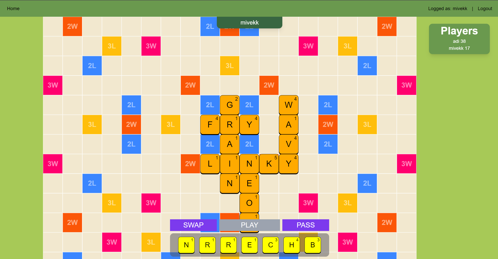
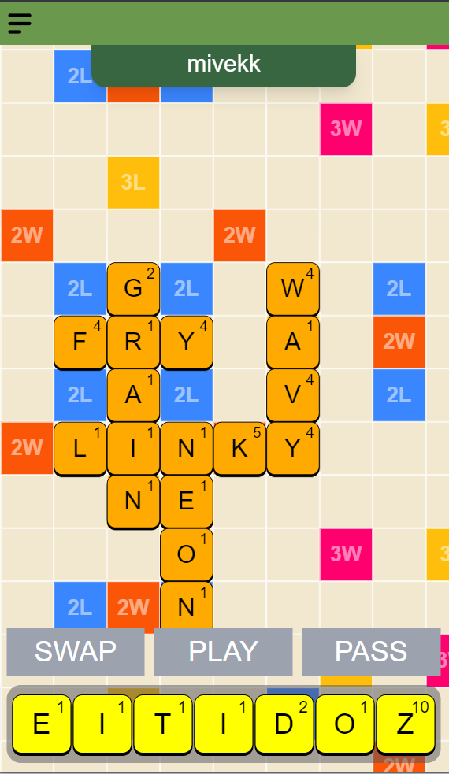

# ligaliter

Scrabble online inspired by Discord's Letter League.

Available (soon) on https://www.ligaliter.com

Built fully on top of AWS infrastructure (RDS, ElastiCache, Route 53, Amplify) with CI/CD pipeline to an EC2 instance.

In the future:

- Using JWT for user authentication
- Adding AWS Cognito for login
- Users can upload their profile image (stored in AWS S3 bucket)
- Optimizing bundle size

<h3>Used following technologies:</h3>

Backend

- Typescript
- TypeGraphQL
- TypeORM
- PostgreSQL
- Redis
- Apollo Server
- Express
- GraphQL
- WebSockets

Frontend

- Typescript
- React
- Next.js
- Tailwind CSS
- URQL
- GraphQL Code Generator

Board showcase on desktop and mobile devices:
 

